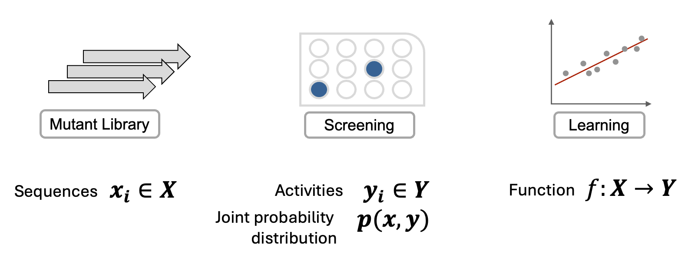
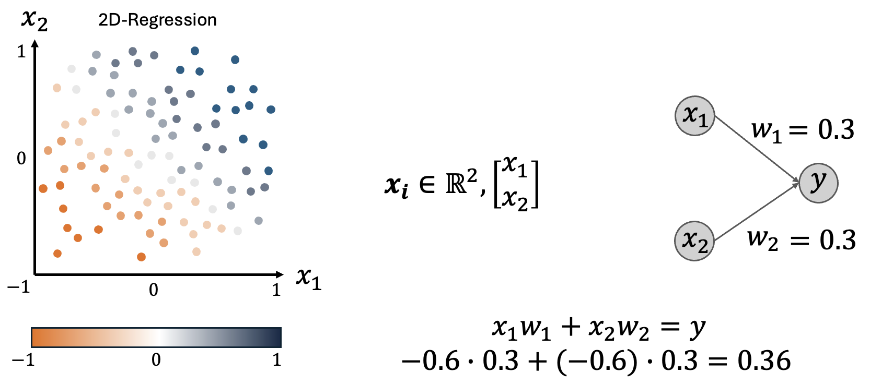
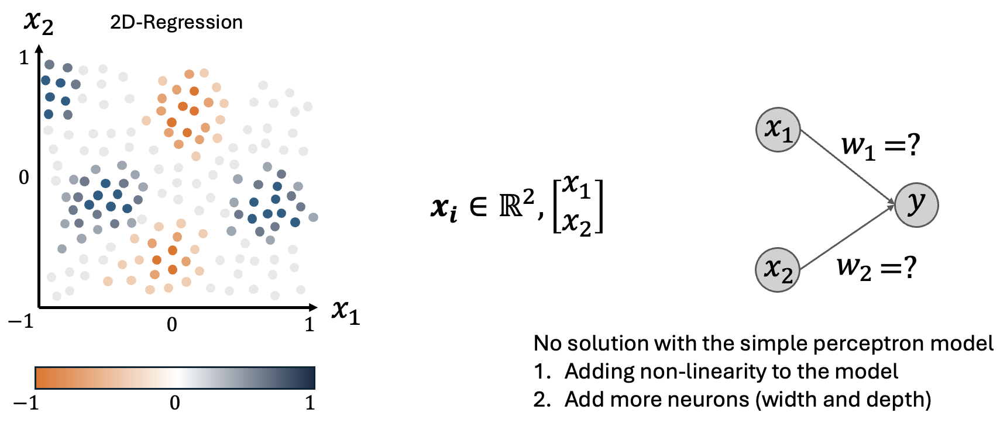

# 01 Introduction to Artificial Neural Networks (ANNs)
Welcome to the exciting world of Artificial Neural Networks (ANNs)! This introductory module is designed to provide a foundational understanding of ANNs, their workings, and their capabilities in protein engineering. We'll explore the core concepts, delve into some fundamental mathematics, and visualize how these networks process information. We will cover the following topics:

- Introduction to universal function approximators.
- The Multi-Layer Perceptrons.
- Gradient based learning.

## The Universal Function Approximator
In biotechnology, you are accustomed to the concept of fitting models to data – whether it's in understanding gene expression patterns, predicting enzymatic activity, or modeling biological processes. Neural networks, at their core, are not fundamentally different. They are powerful tools for fitting complex, high-dimensional data. However, the way they achieve this might be new to you.

Imagine you performed a biochemical assay to quantify the activity of an enzyme library. Mathematically, you could express the data you collected as follows:
- The set of sequences you collected will be called $\vec{x_i} \in \mathbf{X}$. Here $\vec{x_i}$ is a single seqeuence in you dataset and $\mathbf{X}$ is the set of all sequences you measured in your experiments.
- The experimentally determined activity values can be expressed as $\vec{y_i} \in \mathbb{Y}$. Here again the $\vec{y_i}$ are individual measurements and $\mathbb{Y}$ is the set of all activity values you measured in your experiments.

A natural question to ask is how your protein sequence lead to the observed activity? We can approach this problem by first assuming, that there should be some logical reason that leads to the improved activities we observed in our experiments. In other words, we expect that there exists a rule or *function* connecting a protein sequence to the activity we observe. This can again be mathematically expressed as:

- $f:\mathbb{X} \rightarrow \mathbb{Y}$, which is read as "a function $f$, which *maps* my set of sequenes $\mathbb{X}$ to a set of activities $\mathbb{Y}$. In this course you will learn how to find the function that maps your protein sequences to the data you observed using artificial neural networks.

|  | 
|:--:| 
| *Simple protein engineering example illustrating the fundamental ML workflow.* |

## The Multi-Layer Perceptron

### Exploring the Basic Unit: A Single Neuron
Let's begin with the fundamental building block of neural networks: the neuron. In its simplest form, a neuron in an ANN can be thought of as a computational equivalent to a linear regression model. Imagine a neuron as a function $f_\phi$ (read as: $f$ parameterized on $\phi$), which takes an input vector $\vec{x} = [x_1, x_2, ..., x_n]$ - each $x_i$ representing a different feature of your protein sequences, such as different amino acids. Each input $\vec{x_i}$ is associated with a weight $w_i$, signifying its importance, much like coefficients in a regression equation. Mathematically, the output of this neuron, $y$, can be expressed as:

$y=\phi(\vec{x})=\Sigma_{i=1}^nw_i\dot x_i + b$

Here, $b$ is the bias term, an additional parameter in the neuron, akin to the intercept in linear regression, which allows you to adjust the output independently of the input. This linear combination of inputs and weights forms the basis of what the neuron learns during the training process. As simple as this might seem, it’s a powerful concept, laying the groundwork for more complex structures in neural networks.

|  | 
|:--:| 
| *Example of how a single neuron with linear activation functions can solve a simple 2-dimensional regression problem.* |

|  | 
|:--:| 
| *Simple linear models such as the linear single neuron fail at non-linear tasks.* |

### Hidden layers
With the basic understanding of a single neuron, we can now explore the concept of hidden layers in a neural network. Hidden layers are what transform a simple neuron into a more complex and capable neural network. Imagine stacking several neurons together to form a layer, and then stacking multiple such layers. This is the essence of a multi-layer perceptron.

Each neuron in a hidden layer receives input from all the neurons of the previous layer, adding depth to the processing capability of the network. If we consider a single hidden layer with $m$ neurons, and our input vector $\vec{x} = [x_1, x_2, ..., x_n]$, the output of the $j$-th neuron in this layer can be represented as:

$h_j=\phi(\vec{x})=\Sigma_{i=1}^n w_{ij} \dot x_i + b_j$

Where $w_{ji}$ is the weight connecting the $i$-th input to the $j$-th neuron, and $b_j$ is the bias for the $j$-th neuron. The output of the entire hidden layer, then, is a vector $\vec{h} = [h_1, h_2, ..., h_m]$.

This layering and interconnectivity allow neural networks to learn complex relationships. Each layer captures different aspects of the data, building upon the previous layers’ outputs. In the context of protein engineering, you can think of each layer as analyzing different levels of complexity in the protein structure and function relationships, from primary sequences to higher-order interactions.

### Introducing Non-Linearity in ANNs
The true strength of neural networks in modeling complex biological phenomena lies in their ability to introduce non-linearity into the system. This is achieved through what we call activation functions. Let's denote an activation function by $\sigma$. It is applied to the output of each neuron, transforming the linear combination of inputs and weights into a non-linear output. This is crucial because most biological processes, including those in protein engineering, exhibit non-linear characteristics and cannot be accurately modeled with linear equations alone.

Mathematically, the output of a neuron with a non-linear activation function can be represented as:

$y=\sigma(\Sigma_{i=1}^n w_i \dot x_i + b)$

Common choices for $\sigma$ include functions like the Sigmoid ($\sigma(z) = \frac{1}{1 + e^{-z}}$), Hyperbolic Tangent (tanh), and Rectified Linear Unit (ReLU). Each of these functions adds a different type of non-linearity:

**Sigmoid**: It maps the input into a range between 0 and 1, making it useful for models where we need to predict probabilities.

**tanh**: Similar to the sigmoid but maps the input to a range between -1 and 1. It's useful when the model needs to handle negative values.

**ReLU**: Defined as $\sigma(z) = max(0, z)$, it introduces non-linearity while maintaining the simplicity and efficiency of computation. ReLU is particularly popular in deep learning because it allows models to learn faster and perform better.

By applying these non-linear functions, the network can create complex mappings from inputs to outputs, akin to fitting a multi-dimensional curve to data. This capability is what enables neural networks to capture the intricate and nuanced relationships present in protein sequence-activity data, vastly outperforming traditional linear models in such tasks.

## Gradient-Based Learning
Once the architecture of a neural network is set up with neurons, layers, and activation functions, the next crucial step is training the network to make accurate predictions. This is where gradient descent and backpropagation come into play. These concepts are fundamental in the learning process of ANNs, especially in the context of complex tasks like protein engineering.

Gradient Descent: The Core of Learning
Gradient Descent is an optimization algorithm used to minimize the error in the network's predictions. It works by iteratively adjusting the weights and biases in the network to reduce the difference between the actual output and the predicted output. The error is quantified using a cost function, often denoted as $J(w, b)$, where $w$ and $b$ are the weights and biases, respectively.

Mathematically, the update rule in gradient descent can be expressed as:

$w:= w-\alpha\frac{\partial J(w,b)}{\partial w}$
$b:= b-\alpha\frac{\partial J(w,b)}{\partial b}$

Here, $\alpha$ is the learning rate, a small positive number that determines the size of the steps taken towards minimizing the cost. The derivatives $\frac{\partial J(w, b)}{\partial w}$ and $\frac{\partial J(w, b)}{\partial b}$ represent the gradient of the cost function with respect to the weights and biases, pointing towards the direction of steepest ascent in the error surface.

### Backpropagation: Propagating Errors Backwards
Backpropagation is a method used for calculating the gradient of the cost function efficiently. It's a backward pass through the network where the gradient of the error is propagated back through the network. This process involves applying the chain rule of calculus to compute the gradients of the cost function with respect to each weight and bias, layer by layer, from the output layer back to the input layer.

The backpropagation algorithm can be mathematically described by:

Compute the error at the output layer: $\delta^{(L)} = \nabla_a J \odot \sigma'(z^{(L)})$.

For each layer $l = L-1, L-2, ..., 2$, propagate the error backwards: $\delta^{(l)} = ((w^{(l+1)})^T \delta^{(l+1)}) \odot \sigma'(z^{(l)})$.

Update the weights and biases using gradient descent.

In this process, $\nabla_a J$ is the gradient of the cost function with respect to the activation, $\sigma'(z^{(l)})$ is the derivative of the activation function, and $\odot$ denotes element-wise multiplication.

Through these mechanisms, a neural network learns by adjusting its weights and biases to better fit the complex patterns in the data. This is analogous to refining a hypothesis in experimental research based on observed results. By continually updating its parameters, the network becomes increasingly proficient at mapping protein sequences to their respective functional outcomes, thereby turning raw data into meaningful insights.
